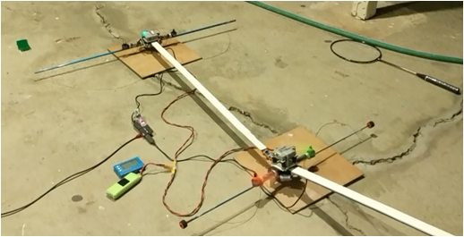

# autonomous flight in Polar coordinate instead of Cartesian coordinate

The design goal is to have one end of the flying vehicle attached to a fixed body, here in the experiment, wall. The joint can rotate freely.
The flight controller, controlling two motors, governs the elevation angle and azimuth angle of the beam. The sensor input list contains:
- Gyro
- Accelerometer
- Magnetometer
- Point cloud measurement device (Kinect running on OpenNI)

Inter-segment connection is a free-rotationing gimbal connector. A Kinect sensor is barely enough to operate the system shown in the picture.

https://youtu.be/IG2OPOJMO9E

